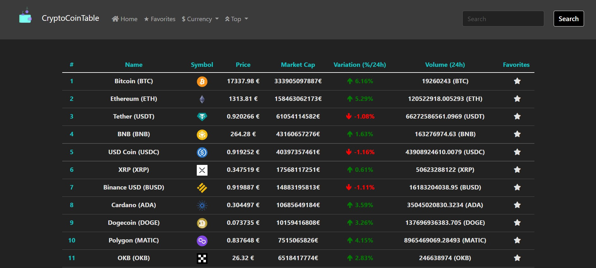
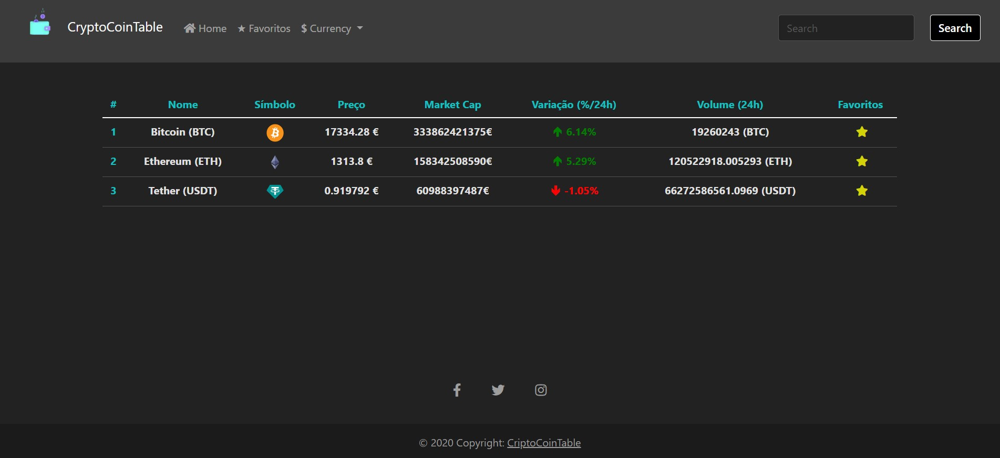
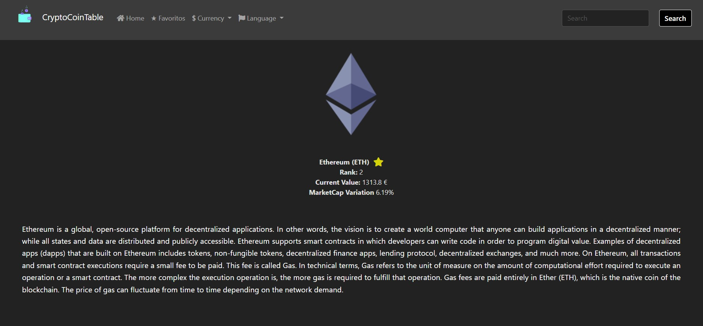

# Project CryptoCoinTable

### Description:

> This project consists of a website that presents information about cryptocurrencies where you can add them to favorites, change the currency and view details about a specific currency.

> Tools Used:
>
> - [HTML5](https://developer.mozilla.org/en-US/docs/Web/Guide/HTML/HTML5)
> - [CSS](https://developer.mozilla.org/en-US/docs/Web/CSS)
> - [Bootstrap](https://getbootstrap.com)
> - [CoinGeck API](https://www.coingecko.com/en/api)

## Development Mode

    git clone https://github.com/JoaoJesus1337/CryptoCoinTable.git

## Main Page

## Favorites Page

## Details Page

 

# CO-Author

 

[@FernandoVideira](https://github.com/FernandoJVideira)
